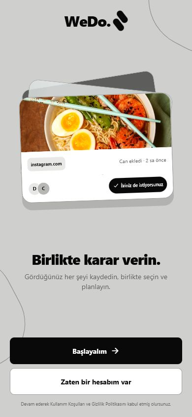
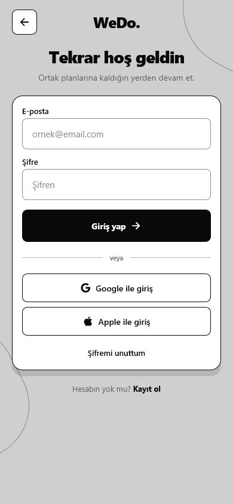
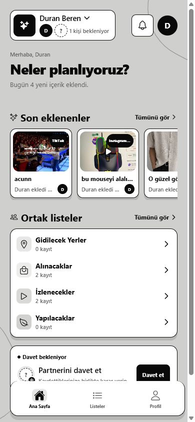
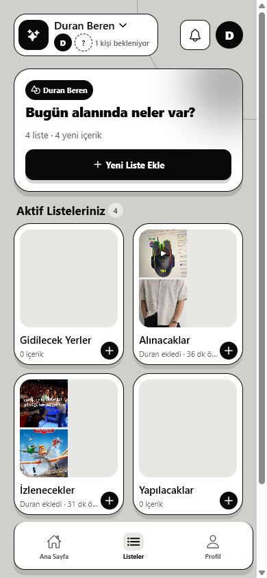
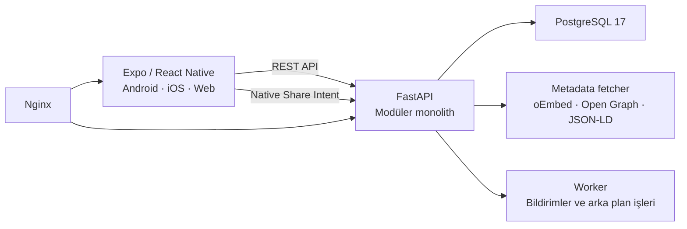
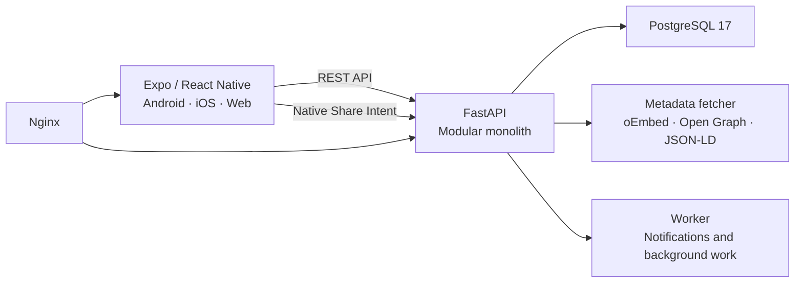

<p align="center">
  
</p>

<p align="center"><strong>Save what inspires you. Decide together. Make it happen.</strong></p>

<p align="center">
  <a href="#turkce"><strong>Türkçe</strong></a> · <a href="#english"><strong>English</strong></a>
</p>

<p align="center">
  
  
  
  
  
</p>

---

## Product preview

<p align="center">
  
  
  
  
</p>

<a id="turkce"></a>

# Türkçe

## WeDo nedir?

WeDo; çiftlerin, arkadaş gruplarının ve birlikte plan yapan herkesin internette karşılaştığı fikirleri ortak bir yerde toplamasını sağlayan mobil öncelikli bir karar ve planlama uygulamasıdır.

Bir TikTok videosu, Instagram Reels, Trendyol ürünü, izlenecek film veya gidilecek mekân… İçeriği cihazınızın **Paylaş** menüsünden WeDo’ya gönderin. WeDo başlık ve görselini hazırlar, onu ortak alanınıza ekler; siz de birlikte değerlendirir, listeler ve gerçeğe dönüştürürsünüz.

### Neyi çözer?

İlhamlar genelde sohbetler, sekmeler, kaydedilenler ve ekran görüntüleri arasında kaybolur. WeDo, “bunu yapalım mı?” anını ortak bir karar akışına dönüştürür:

1. **Kaydet:** Bağlantı, metin veya görseli paylaşın.
2. **Birlikte görün:** İçerik ortak alana, doğru önizleme ile düşsün.
3. **Düzenle:** İçeriği izlenecekler, alınacaklar veya gidilecek yerler gibi listelere taşıyın.
4. **Hayata geçir:** Yorumlayın, tepki verin, planlayın ve tamamlandı olarak işaretleyin.

### Öne çıkan yetenekler

| Alan | WeDo deneyimi |
| --- | --- |
| Paylaşarak kaydetme | Android/iOS paylaşım menüsünden bağlantı, metin ve görsel yakalama |
| Akıllı önizleme | Genel web için Open Graph, Twitter Card ve JSON-LD; YouTube ve TikTok için oEmbed desteği |
| Ortak alanlar | Üyeler, davet bağlantıları ve birlikte kullanılan içerik alanları |
| Ortak listeler | Gidilecek Yerler, Alınacaklar, İzlenecekler, Yapılacaklar ve özel listeler |
| Karar akışı | İçerik detayları, yorumlar, tepkiler, aktivite geçmişi ve tamamlanma durumu |
| Planlama | Planlar, hatırlatmalar ve bildirim altyapısı |
| Güvenli hesaplar | Argon2 parola hashleme, kısa ömürlü JWT, refresh-token rotation ve giriş/kayıt oran sınırlama |

### Desteklenen içerik kaynakları

WeDo, açık web sayfaları için standart metadata çıkarma zincirini kullanır. Bu sayede sosyal medya, video, alışveriş, seyahat, etkinlik ve içerik sitelerinden paylaşılan birçok açık bağlantı başlık ve görsel önizlemesiyle kaydedilebilir. YouTube ve TikTok için oEmbed önceliklidir; diğer kaynaklar Open Graph, Twitter Card ve JSON-LD bilgilerinden yararlanır.

> Bazı platformlar görsel veya metadata erişimini oturum, bölgesel kısıt ya da bot koruması nedeniyle sınırlayabilir. WeDo bu durumda ulaşılabilen güvenli metadata ile devam eder.

### Mimari



| Katman | Teknolojiler |
| --- | --- |
| İstemci | React Native, Expo Router, TypeScript, Zustand, TanStack Query |
| Native özellikler | Expo Share Intent, Expo Notifications, Secure Store |
| API | FastAPI, Pydantic Settings, SQLAlchemy 2, Alembic |
| Veri ve işler | PostgreSQL 17, arka plan worker’ı |
| Yerel ortam | Docker Compose, Nginx, `uv`, `pnpm` |

### Proje yapısı

```text
WeDo/
├── frontend/              # Expo / React Native uygulaması
│   ├── src/app/           # Expo Router ekranları
│   └── assets/            # Uygulama ikonları ve görseller
├── backend/               # FastAPI uygulaması
│   ├── app/modules/       # Auth, spaces, items, lists, metadata, uploads...
│   ├── migrations/        # Alembic veritabanı migration’ları
│   └── tests/             # Backend testleri
├── docs/images/           # README ürün ekranları
└── compose.yml            # Web, API, worker ve PostgreSQL
```

## Hızlı başlangıç

### Gereksinimler

- Docker Desktop ve Docker Compose
- Yerel geliştirme için: Python 3.13 + `uv`, Node.js + `pnpm`

### Docker ile çalıştırma

```powershell
git clone <REPO_URL>
Set-Location WeDo
Copy-Item backend/.env.example backend/.env
Copy-Item frontend/.env.example frontend/.env
docker compose up --build
```

| Servis | Adres |
| --- | --- |
| Web uygulaması | `http://localhost:8081` |
| API | `http://localhost:8000` |
| API sağlık kontrolü | `http://localhost:8000/health` |
| Swagger / OpenAPI | `http://localhost:8000/docs` |

Servisleri kapatmak için:

```powershell
docker compose down
```

### Docker olmadan geliştirme

```powershell
# Terminal 1 — backend
Set-Location backend
python -m uv sync --dev
python -m uv run alembic upgrade head
python -m uv run uvicorn app.main:app --reload

# Terminal 2 — frontend
Set-Location frontend
pnpm install
pnpm start
```

`frontend/.env` içindeki `EXPO_PUBLIC_API_URL`, cihazın erişebildiği API adresini göstermelidir. Fiziksel Android cihazda bilgisayarınızın yerel ağ IP adresini kullanın; `localhost` cihazın kendisini ifade eder.

## Güvenlik yaklaşımı

- Parolalar Argon2 ile hashlenir; düz metin olarak saklanmaz.
- Access token’lar kısa ömürlüdür; refresh token’lar rotasyonla yenilenir.
- Giriş ve kayıt istekleri oran sınırlamasına tabidir.
- Metadata isteklerinde SSRF koruması ve yanıt boyutu sınırları uygulanır.
- `.env`, build çıktıları, loglar ve anahtar dosyaları `.gitignore` ile korunur.

---

<a id="english"></a>

# English

## What is WeDo?

WeDo is a mobile-first shared decision and planning app for couples, friend groups, and anyone who wants to turn online inspiration into real plans.

See a TikTok, Instagram Reel, product, movie, restaurant, or event? Send it to WeDo from the device **Share** menu. WeDo prepares the title and preview image, adds it to your shared space, and gives everyone a clear place to discuss, organize, decide, and follow through.

### The problem it solves

Ideas disappear across chats, browser tabs, saved posts, and screenshots. WeDo turns the simple question “should we do this?” into a shared flow:

1. **Save** a link, text, or image from the Share menu.
2. **See it together** in a shared space with useful previews.
3. **Organize** it into lists such as Watch, Buy, or Places to Go.
4. **Make it happen** with reactions, comments, plans, reminders, and completion states.

### Key capabilities

| Area | WeDo experience |
| --- | --- |
| Share-to-save | Capture links, text, and images from Android/iOS share sheets |
| Smart previews | Open Graph, Twitter Card, and JSON-LD for the open web; oEmbed support for YouTube and TikTok |
| Shared spaces | Members, invite links, and collaborative content spaces |
| Shared lists | Places to Go, Shopping, Watchlist, To-Do, and custom collections |
| Decision flow | Item detail, comments, reactions, activity history, and completion status |
| Planning | Plans, reminders, and notification foundations |
| Secure accounts | Argon2 password hashing, short-lived JWTs, refresh-token rotation, and auth rate limiting |

### Content-source support

WeDo uses a standards-based metadata pipeline for public web pages. Shared links from social, video, shopping, travel, event, and content sites can be saved with available titles and preview images. YouTube and TikTok use oEmbed first; other sources use Open Graph, Twitter Card, and JSON-LD metadata.

> Some platforms can restrict image or metadata access based on sign-in, region, or bot protection. In those cases, WeDo safely falls back to the metadata it can access.

### Architecture



| Layer | Technologies |
| --- | --- |
| Client | React Native, Expo Router, TypeScript, Zustand, TanStack Query |
| Native capabilities | Expo Share Intent, Expo Notifications, Secure Store |
| API | FastAPI, Pydantic Settings, SQLAlchemy 2, Alembic |
| Data and jobs | PostgreSQL 17 and a background worker |
| Local stack | Docker Compose, Nginx, `uv`, and `pnpm` |

## Run the project

### Prerequisites

- Docker Desktop and Docker Compose
- For local development: Python 3.13 with `uv`, plus Node.js and `pnpm`

### Run with Docker

```powershell
git clone <REPO_URL>
Set-Location WeDo
Copy-Item backend/.env.example backend/.env
Copy-Item frontend/.env.example frontend/.env
docker compose up --build
```

Open the web app at `http://localhost:8081`, API docs at `http://localhost:8000/docs`, and the health endpoint at `http://localhost:8000/health`.

### Run without Docker

```powershell
# Terminal 1 — backend
Set-Location backend
python -m uv sync --dev
python -m uv run alembic upgrade head
python -m uv run uvicorn app.main:app --reload

# Terminal 2 — frontend
Set-Location frontend
pnpm install
pnpm start
```

For a physical Android device, set `EXPO_PUBLIC_API_URL` in `frontend/.env` to a LAN-reachable API address rather than `localhost`.

## Security at a glance

- Passwords are hashed with Argon2 and never stored in plain text.
- Access tokens are short-lived and refresh tokens rotate on use.
- Sign-in and sign-up endpoints are rate limited.
- Metadata fetching applies SSRF controls and response-size limits.
- `.env` files, signing keys, build outputs, and logs are ignored by Git.

---

<p align="center"><strong>WeDo keeps ideas from getting lost — so they can be chosen together and made real. ✦</strong></p>
